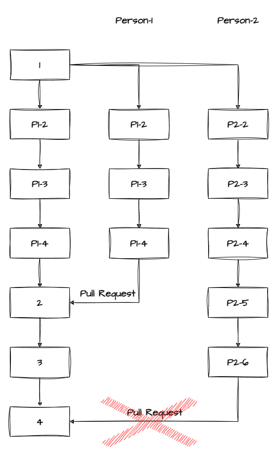

# GIT STAGES #


# GIT BRANCH #

* To create a brnach
```
git branch <branch_name>
```
* To move from one brnach to another
```
git checkout <branch_name_you_want_to_move>
```
# BRANCHING STRATEGY #
### __Master and Feature branching strategy__

MASTER -> Main branch(Long lived)<br/>
FEATURE -> Developement branch(Short lived)

We protect the Master branch. No one can directly make commits in Master branch. Only changes in Master branch can be done through PR with minimum 3 approvals.</br>


# PULL REQUEST #
Getting code from one branch to another branch. 

* ### PR Types: ####


1. #### Create Merge commit: ####
    When we merge the code from Feature branch to Master we will get new commit id in the Master branch. All the __commit history from feature branch will also be preserved but those commits will not be part of Master branch__.</br>
    

2. #### Rebase and merge: ####
    When we merge the code from Feature to Master branch no new commit will be created in Master bramch. Commit history will not be preserved. All __commits from Feature branch will be copied to Master branch but commit ids will be changed.__.</br>
    

    ### Difference between Merge and Rebase ###
    | Git Merge | Git Rebase |
    | :---: | :---: |
    | Allows users to merge branches in Git. | Allows users to integrate changes from one branch to another. |
    | Merging creates a chain-like branch structure. | Rebasing creates a linear branch structure. |
    | Logs include the complete commit merging history. | Rebase logs are linear and the history is altered to reflect that. |
    | Combines all the commits on the feature branch as a single commit in the master branch. | Rebases all the commits to the target branch and adds the same number of commits. |
    | Easier to use than git rebase. | More complex than git merge. |
    | Used for projects where the target branch is supposed to be shared. | Usually used for projects where the target branch is private. |
    | Suitable when many people are working on the project simultaneously. | Suitable for small workgroups. |
    
3. #### Squash and merge: ####
    When we merge the code from Feature to Master branch, commit history from feature branch is __merged/squashed into one single commit in Master branch__. Commit history is not preserved.</br>
    

# GIT CONFLICT #
Lets consider 2 persons __Person-1__ & __Person-2__.</br>
Both clones the repo simultaneously and started working on it. But Person-1 has completed the task and pushed the changes to branch through PR. </br>
Person-2 completed the work and rised PR after the Person-1 code changes are available in the branch.</br>

If both persons changes are related with any of the below changes this will rise git conflict.
* Different text on the same line
* Changes in different parts of the same file
* File-level conflicts
* Renaming or moving files
* Binary files
* Structural conflicts

__This will create a conflict while merging the PR. Since the repo he cloned is not same as the repo he is about to merge(Since another person has already made changes prior to him and changes are available in the repo).__</br>


### The BEST Practice to avoid conflict while PR merge is to keep the repo always updated using git pull before pushing. ###

